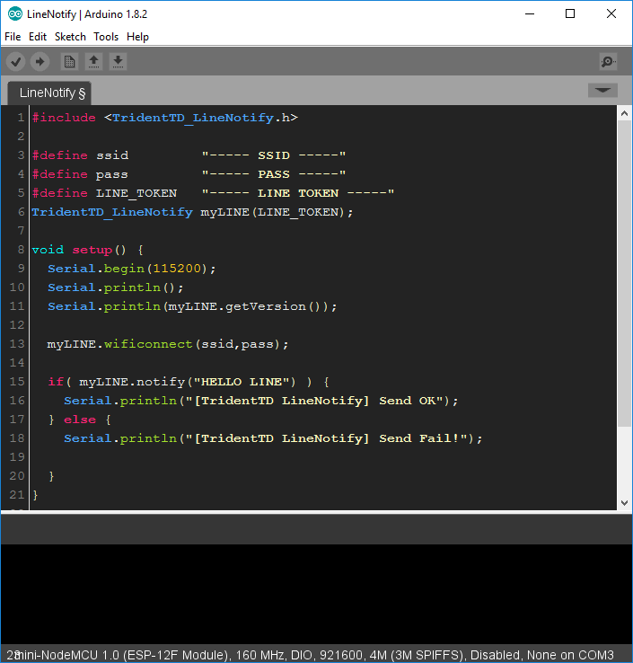

**Sublime-like Theme for ArduinoIDE**
# Trident Arduino Theme

วิธีการติดตั้ง "ธีม"" นี้ ให้ ArduinoIDE
------

ให้เข้าไปที่ C:\Program Files (x86)\Arduino\lib

เปลี่ยนชื่อโฟลเดอร์ theme ในนั้น เป็น theme_backup

จากนั้นให้ สำเนา โฟลเดอร์ theme

ไปไว้ที่ C:\Program Files (x86)\Arduino\lib แทน

แล้วเปิด ArduinoIDE ขึ้นมาใหม่

ก็จะได้ธีม หน้าตาคล้าย Sublime Editor

12 มิถุนายน พ.ศ.2560

วันจันทร์ แรม ๓ ค่ำ เดือน ๗ ปีระกา
